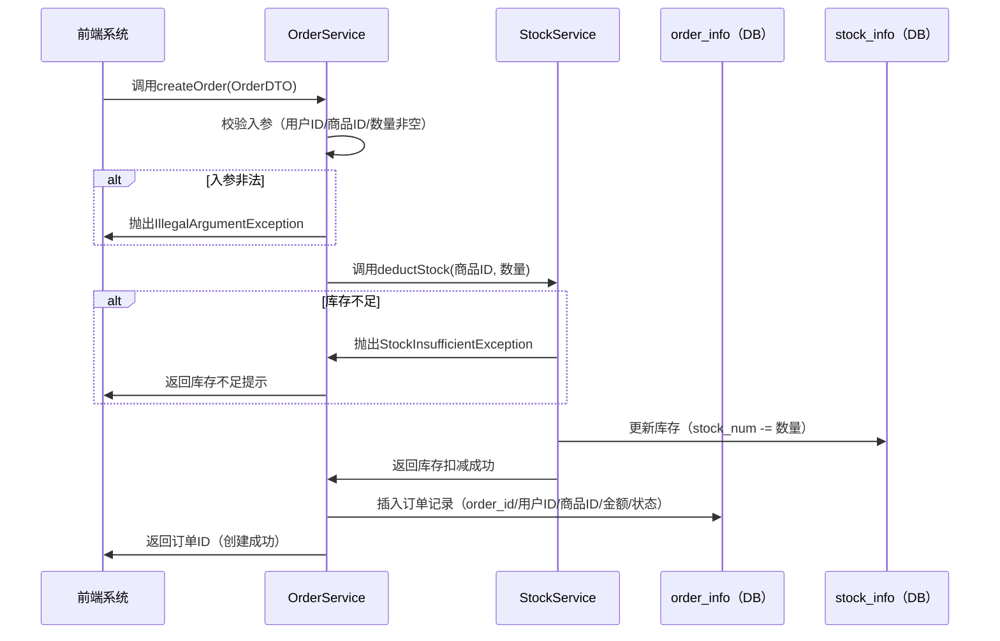
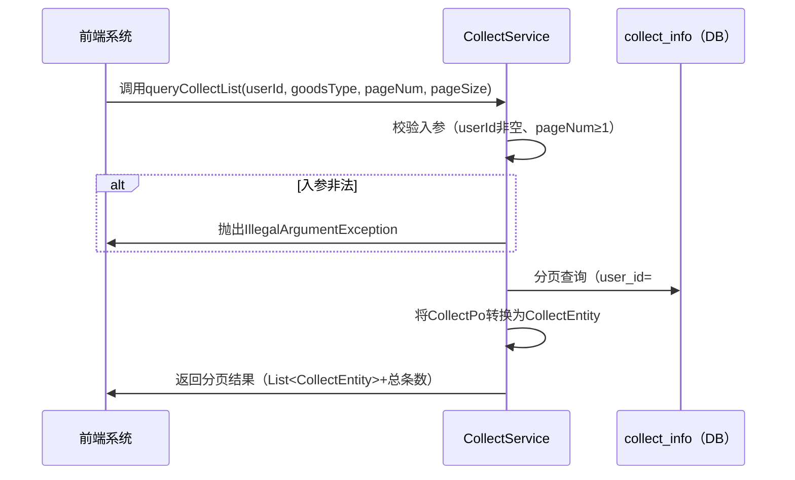

# java-function-documentation-generator

## 功能概述

本 Skill 专为 Java 函数梳理文档场景设计，遵循「先搭骨架、后填血肉」的逻辑，优先梳理函数的执行时序、涉及的库表及变更，再补充基础信息、入参返回值、异常处理等细节，最终生成结构化、易理解、可落地的函数梳理文档，适配团队协作、代码维护、新人交接等场景。

## 适用场景

需要为 Java 项目中的单个函数编写梳理文档，尤其适用于以下场景：
- 涉及数据库操作、跨服务调用的复杂业务函数（如订单创建、支付回调、库存扣减）
- 核心函数需要长期维护，需让团队成员快速理解流程和数据逻辑
- 新人接手项目，需通过文档快速掌握函数的使用方式和注意事项
- 函数迭代后，需更新文档记录变更点（如库表字段、逻辑调整）

## 文档结构规范

函数梳理文档按「前置核心信息（骨架）+ 细节补充信息（血肉）」分层，核心结构如下：

| 模块分类       | 核心模块                | 作用                     |
|----------------|-------------------------|--------------------------|
| 前置核心信息   | 函数核心定位            | 快速锚定函数核心作用     |
| 前置核心信息   | 整体时序图              | 展示函数执行全流程       |
| 前置核心信息   | 涉及的库表              | 明确函数操作的数据载体   |
| 前置核心信息   | 库表变更记录            | 追溯表结构变更及函数影响 |
| 细节补充信息   | 基础信息                | 函数标识（类、签名、版本）|
| 细节补充信息   | 核心说明                | 功能、目的、适用场景     |
| 细节补充信息   | 入参/返回值详解         | 无歧义说明参数和返回结果 |
| 细节补充信息   | 异常处理                | 明确异常类型和处理建议   |
| 细节补充信息   | 调用依赖                | 说明函数关联的服务/组件  |
| 细节补充信息   | 示例代码                | 提供可直接参考的调用示例 |
| 细节补充信息   | 注意事项                | 边界条件、性能、幂等性等 |

## 操作流程

### 1. 收集函数核心定位
先通过一句话明确函数的核心作用，聚焦「做什么」而非「怎么做」，示例：
> 核心作用：接收前端下单请求，完成订单数据校验、库存扣减、订单入库，最终返回订单ID（涉及数据库操作+跨服务调用）

### 2. 绘制整体时序图
按「调用方→核心服务→外部依赖→数据库」的逻辑梳理执行流程，标注异常分支，使用 Mermaid 语法绘制：

### 3. 梳理涉及的库表
仅列出函数「直接操作」的库表，明确表名、所属库、核心作用及函数操作的字段：
| 表名         | 所属库       | 核心作用                     | 核心字段（函数操作的字段）|
|--------------|--------------|------------------------------|--------------------------------|
| order_info   | order_db     | 存储订单核心信息             | order_id、user_id、goods_id、amount、order_status |
| stock_info   | stock_db     | 存储商品库存信息             | goods_id、stock_num            |

### 4. 记录库表变更记录
关联函数版本，梳理表结构变更及对函数的影响：
| 变更版本 | 变更时间   | 变更表       | 变更内容                                  | 对函数的影响                                   |
|----------|------------|--------------|-------------------------------------------|------------------------------------------------|
| v1.0     | 2026-01-10 | order_info   | 初始创建表，包含order_id、user_id、goods_id | 函数仅插入基础订单信息                         |
| v1.1     | 2026-02-15 | order_info   | 新增order_status字段（默认值：待支付）| 函数插入订单时需赋值order_status='待支付'       |

### 5. 补充细节信息
按规范填充基础信息、入参/返回值、异常处理等模块，确保信息无歧义、可落地：
- 基础信息：明确函数所属类、签名、版本、修改人
- 入参/返回值：用表格说明参数类型、必填性、含义、示例
- 异常处理：说明异常类型、触发条件、调用方处理建议
- 示例代码：提供完整的调用示例，包含入参构造、异常捕获

### 6. 校验文档完整性
检查以下核心要点，确保文档准确完整：
- 时序图覆盖核心流程和异常分支
- 库表仅包含函数直接操作的表，字段无冗余
- 入参/返回值说明无歧义，示例可运行
- 注意事项覆盖边界条件、性能、幂等性等关键信息

## 示例

### 函数核心定位
> 核心作用：根据用户ID和商品类型查询用户的收藏列表，支持分页，返回结构化的收藏数据（仅读数据库，无跨服务调用）

### 整体时序图

### 涉及的库表
| 表名         | 所属库       | 核心作用                     | 核心字段（函数操作的字段）|
|--------------|--------------|------------------------------|--------------------------------|
| collect_info | user_db      | 存储用户商品收藏信息         | id、user_id、goods_id、goods_type、create_time |

### 基础信息（节选）
- 所属类：com.example.user.service.CollectService
- 函数签名：public PageInfo<CollectEntity> queryCollectList(Long userId, String goodsType, Integer pageNum, Integer pageSize) throws IllegalArgumentException
- 版本：v1.0

### 入参详解（节选）
| 参数名    | 类型      | 是否必填 | 含义               | 取值示例                     |
|-----------|-----------|----------|--------------------|------------------------------|
| userId    | Long      | 是       | 用户ID             | 1001                         |
| goodsType | String    | 是       | 商品类型           | "ELECTRONIC"、"CLOTHING"      |
| pageNum   | Integer   | 是       | 页码               | 1（≥1）|
| pageSize  | Integer   | 是       | 每页条数           | 20（1~50）|

## 文档规范

1. **时序图规范**：仅列核心参与方，跳过日志打印、参数转换等细节，标注异常分支
2. **库表规范**：只梳理函数「直接操作」的表，核心字段仅列函数插入/更新/查询的字段
3. **参数规范**：入参说明需包含「是否必填+取值范围+示例」，避免仅写参数名
4. **示例规范**：调用示例需完整，包含入参构造、异常捕获，可直接复制运行
5. **变更规范**：库表变更需关联函数版本，明确「变更内容+对函数的实际影响」

## 常见问题

**Q: 函数无数据库操作，是否需要梳理库表模块？**
A: 不需要。可直接跳过「涉及的库表」和「库表变更记录」模块，重点补充「调用依赖」（如外部接口、缓存）。

**Q: 简单工具类函数（如字符串处理），是否需要绘制时序图？**
A: 无需绘制时序图。可将「整体时序图」替换为「核心执行步骤」，用文字分点说明函数的执行逻辑（如“1. 校验入参是否为空 2. 替换字符串中的特殊字符 3. 返回处理结果”）。

**Q: 如何处理函数的多版本变更？**
A: 在「基础信息」中标注当前版本，在「注意事项」中新增「版本变更记录」模块，分版本说明函数的核心调整（如“v1.0：初始版本，仅支持单个参数；v1.1：新增批量处理逻辑，入参改为列表类型”）。

### 总结
1. 函数梳理文档遵循「先宏观（时序/库表）、后微观（入参/示例）」的结构，优先建立阅读者对函数的整体认知；
2. 核心模块需保证「无歧义、可落地」，如参数说明包含取值范围、示例代码可直接运行；
3. 可根据函数类型灵活调整模块（如无数据库操作则跳过库表模块），避免冗余信息。