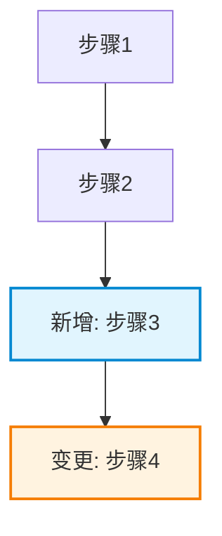
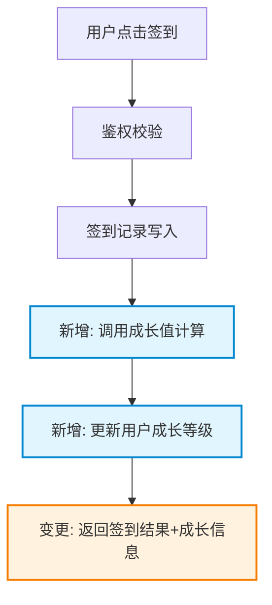

# 模块详细设计

通过迭代式协作对话，将 PRD 需求和现有模块文档转化为详细的模块设计规格。

## 适用场景

- 为模块创建详细设计文档
- 基于 PRD 需求设计模块架构
- 编写涵盖需求、设计、数据库、接口和工时的模块规格

## 核心原则

1. **对话驱动** - 每个设计决策都通过与用户对话确认，未经确认不进入下一节
2. **简洁优先** - 删除一切不影响理解的冗余描述，每段必须传递有效信息
3. **代码可追溯** - 所有设计必须引用真实代码路径、枚举值、接口定义，杜绝凭空编造
4. **新旧明确标记** - 已有内容标记 `[已有]`，新增内容标记 `[新增]`，修改内容标记 `[变更]`
5. **仅伪代码** - 数据库和接口设计使用伪代码，真实代码在单独编码阶段完成
6. **严格 YAGNI** - 从所有设计中移除不必要的功能

## 对话协作规则（HARD-GATE）

> **在用户明确确认当前节设计方案之前，禁止进入下一节。无论设计看起来多简单，都必须经过对话确认。**

### 对话原则

- **每次只问一个问题** — 不要一次抛出多个问题让用户应接不暇
- **优先选择题** — 能给选项就不问开放题，降低用户回答成本
- **先亮推荐方案** — 提出 2-3 种方案时，以推荐方案开头并说明理由
- **逐段展示** — 每次展示 200-300 字的设计内容，确认后再继续
- **随时回退** — 用户有疑问时立即回退澄清，不硬推方案

### 每节对话流程

```
探索 → 提案 → 倾听 → 调整 → 确认 → 下一节
  │       │       │       │       │
  │       │       │       │       └─ 用户明确说"OK/确认/可以"才算通过
  │       │       │       └─ 根据反馈修改设计
  │       │       └─ 收集用户反馈和替代建议
  │       └─ 展示设计草案 + 2-3 种方案（附取舍分析）
  └─ 了解用户对当前节的预期和约束
```

### 对话中的提问模式

**理解意图时**（探索阶段）：
- "这个功能的核心目标是 [X]，对吗？还是更偏向 [Y]？"
- "这里有个约束我想确认：[约束描述]。这个理解正确吗？"

**提出方案时**（提案阶段）：
- "我推荐方案 A：[描述]。原因是 [理由]。方案 B 也可行：[描述]，但代价是 [取舍]。你倾向哪个？"
- "这个流程我设计了 [X] 步，核心逻辑是 [描述]。有没有我遗漏的场景？"

**确认推进时**（确认阶段）：
- "以上是第 X 节的设计，确认没问题的话我进入第 Y 节。"
- 用户必须给出明确肯定回复（如"OK"、"确认"、"可以"、"没问题"）才算通过

## 输出规则（强制）

> **所有输出必须遵循 `references/references.md` 中的 spec 规范。**
> - 各节长度约束、禁止项、写作风格、代码可追溯规则、Mermaid 图例约定、接口设计模板
> - 引用已有代码的标注格式（`[已有]`、`[新增]`、`[变更]`）
> - 代码路径格式：`src/modules/xxx/enums.ts#StatusEnum`

### 各节长度约束

| 章节 | 最大长度 | 格式要求 |
|------|---------|---------|
| 第一节（背景） | 3 句话 | 纯文字，仅引用 PRD 章节号 |
| 第二节（需求分析） | 1 张表 | 仅表格，表前表后不写文字 |
| 第三节（设计目标） | 1 张表，≤10 行 | 仅表格 |
| 第四节（名词解释） | 1 张表 | 仅表格，无新术语则跳过 |
| 第五节（方案设计） | 不限长度，必须详尽 | Mermaid 图 + 代码映射表 + 变更明细表，每个功能点必须说清：改哪里、怎么改、为什么改 |
| 第六节（数据库设计） | 仅 SQL | SQL 含行内注释，不另写字段说明表 |
| 第七节（接口设计） | 按模板逐个接口 | 严格遵循模板，不写额外说明 |
| 第八节（其他） | 1 张表 + 编号列表 | 不展开描述 |

### 禁止项

- **禁止** 开场白："本节将讨论……"、"下面我们来分析……"
- **禁止** 总结句："综上所述……"、"如上表所示……"
- **禁止** 复述 PRD 内容 — 改写为 `见 PRD §3.2`
- **禁止** 解释为什么要展示表格/图表 — 直接展示
- **禁止** 废话短语："值得注意的是"、"如前所述"、"需要指出的是"、"为了实现"、"出于……目的"
- **禁止** 描述接下来要做什么 — 直接做
- **禁止** SQL 行内注释已说明字段时再另写字段说明表

### 反面示例（禁止产出类似内容）

```
❌ 错误 — 冗长，复述显而易见的信息：
"## 二、需求分析
根据 PRD 文档，我们梳理了本模块需要实现的以下需求。
需求按优先级分类，并与现有能力进行了对比分析。
以下是每项需求的详细拆解及当前系统的支持情况。"
[表格]
"如上表所示，共有 5 项需求需要新开发，2 项需要对现有功能进行修改。"

✅ 正确 — 表格自己说话：
"## 二、需求分析"
[表格]
```

```
❌ 错误 — 字段说明与 SQL 注释重复：
[每个字段含 COMMENT 的 SQL]
"### 字段说明"
[表格重复相同信息]

✅ 正确 — SQL 注释即唯一信息源：
[每个字段含 COMMENT 的 SQL，无其他内容]
```

```
❌ 错误 — 旁白解说图表：
"下图展示了用户成长值计算的流程。可以看到，流程从接收请求开始，
然后进行参数校验……"

✅ 正确 — 图表 + 代码映射表，无旁白：
[mermaid 图]
[代码映射表]
```

### 写作风格

- 能用表格绝不写段落
- 每个设计决策附一句话理由，不多写
- 所有代码引用使用完整路径：`src/modules/xxx/enums.ts#StatusEnum`
- 如果删掉一句话不丢失信息，就删掉它

## 代码可追溯规则

### 引用已有代码（防止 AI 幻觉）

设计文档中涉及的所有已有代码元素必须标注来源：

| 元素类型 | 标注格式 | 示例 |
|---------|---------|------|
| 枚举值 | `[已有] 文件路径#枚举名` | `[已有] src/enums/user.ts#UserStatus` |
| 接口/API | `[已有] 文件路径#方法名` | `[已有] src/services/user.ts#getUserById` |
| 数据表 | `[已有] 表名` | `[已有] t_user` |
| 配置项 | `[已有] 文件路径#配置键` | `[已有] config/app.yaml#redis.ttl` |
| 类型定义 | `[已有] 文件路径#类型名` | `[已有] src/types/order.ts#OrderDTO` |

### 新增代码定位

所有新增代码必须指定目标位置：

```
[新增] 文件: src/modules/growth/enums.ts
[新增] 枚举: GrowthStageEnum { STAGE_1 = 1, STAGE_2 = 2 }
[新增] 说明: 用户成长阶段枚举，供 growth 模块内部使用
```

```
[变更] 文件: src/services/user.ts#getUserById
[变更] 内容: 返回值新增 growthLevel 字段
[变更] 影响: 所有调用方需适配新字段
```

### 验证清单（每个设计节点必须回答）

- [ ] 引用的枚举/常量是否在代码库中真实存在？
- [ ] 引用的接口签名是否与源码一致？
- [ ] 新增代码的目标文件路径是否存在？
- [ ] 复用的表结构字段是否与数据库一致？

## 输入文档

1. **PRD 文档** - 产品需求和功能规格
2. **整体架构文档** - 系统架构和模块边界
3. **模块技术文档** - 模块级技术细节
4. **模块源代码** - 当前实现和代码模式

## 设计流程

### 0. 项目上下文探索（设计前必做）

在开始任何设计之前：

1. **了解现状** — 阅读项目文件、文档、最近的提交记录
2. **评估范围** — 如果需求涉及多个独立子系统，先与用户讨论拆分方式，再逐个设计
3. **建立可复用资产清单** — 扫描代码库中的枚举、接口、类型、工具函数
4. **与用户对齐理解**：
   - 摘要你对 PRD 需求的理解，让用户确认
   - 展示可复用资产清单，确认哪些可以复用
   - 确认设计范围和边界

> **用户确认理解正确后，才进入第一节。**

### 1. 项目背景（第一节）

**输出**：需求拆解表含差距分析

| 需求点 | 优先级 | 现有能力 | 差距 | 涉及代码 |
|-------|-------|---------|------|---------|
| [需求] | P0/P1/P2 | [已有] xxx / 不支持 | [差距描述] | `[已有] path` 或 `[新增]` |

- 不复述 PRD 原文，仅引用 PRD 章节号
- 每个需求点标注涉及的已有代码或需新增的代码位置

**与用户确认**：

> **对话 1（探索）**："我把 PRD 需求拆成了以下功能点：[表格]。有遗漏或理解偏差吗？"
> **对话 2（方案）**：如果某需求有多种实现思路："这个需求可以 A: [做法] 或 B: [做法]，我推荐 A 因为 [理由]。你怎么看？"
> **对话 3（确认）**："需求分析确认没问题的话，我进入设计目标。"

### 3. 设计目标（第三节）

**输出**：简洁目标表，不超过 10 条

| 类别 | 目标 | 度量标准 |
|------|------|---------|
| 架构 | [目标] | [标准] |
| 功能 | [目标] | [标准] |
| 性能 | [目标] | [标准] |

**与用户确认**：

> **对话**："设计目标如上，特别是性能指标 [X]，这个标准是否符合预期？有需要调整的吗？"
> 用户确认后进入第四节。

### 4. 名词解释（第四节）

仅定义本文档新引入的术语，通用术语不列入。

| 术语 | 定义 | 对应代码 |
|------|------|---------|
| [术语] | [定义] | `[已有] path#Name` 或 `[新增]` |

### 5. 方案设计（第五节）⚠️ 本节要求详尽，不限长度

> **本节是整个文档的核心。每个功能点必须说清三件事：改哪里（Where）、怎么改（How）、为什么改（Why）。宁可写多，不可遗漏。**

**5.1 架构设计**
- 模块架构图（mermaid），标注 [已有]/[新增]/[变更] 模块
- 架构变更说明表：

| 变更点 | 变更前 | 变更后 | 原因 |
|-------|-------|-------|------|
| [组件/模块名] | [现状描述] | [目标状态] | [为什么要改] |

**5.2 模块职责划分**

| 模块 | 职责 | 状态 | 变更说明 |
|------|------|------|---------|
| [模块] | [职责] | [已有]/[新增]/[变更] | 仅 [变更] 时填写：改了什么、为什么 |

**5.3 流程设计**

按功能点逐个输出，每个功能点自成一体，包含：流程图 → 涉及文件与变更明细 → 影响范围。**缺一不可。**

**图例约定**：
- 新增节点用 `:::new_node` 蓝色高亮
- 变更节点用 `:::changed_node` 橙色高亮
- classDef 定义：
```
classDef new_node fill:#e1f5fe,stroke:#0288d1,stroke-width:2px
classDef changed_node fill:#fff3e0,stroke:#f57c00,stroke-width:2px
```

---

#### 模板：5.3.X [功能点名称]

**流程图**：


**代码映射表**：

| 流程节点 | 对应代码 | 状态 |
|---------|---------|------|
| 步骤1 | `src/path/file.ts#method` | [已有] |
| 步骤2 | `src/path/file.ts#method` | [已有] |
| 步骤3 | `src/path/file.ts#method` | [新增] |
| 步骤4 | `src/path/file.ts#method` | [变更] |

**变更明细表**（仅列出 [新增] 和 [变更] 节点）：

| 流程节点 | 对应代码 | 怎么改（How） | 为什么改（Why） |
|---------|---------|--------------|----------------|
| 步骤3 | `src/path/file.ts#method` | 具体实现描述 | PRD §x.x 需求原因 |
| 步骤4 | `src/path/file.ts#method` | 具体修改描述 | PRD §x.x 需求原因 |

**影响范围**：

| 受影响代码 | 影响方式 | 需要的适配 |
|-----------|---------|-----------|
| `[已有] src/path/file.ts#method` | [影响描述] | [适配措施] |

---

#### 完整示例：5.3.1 用户签到获得成长值

**流程图**：


**代码映射表**：

| 流程节点 | 对应代码 | 状态 |
|---------|---------|------|
| 鉴权校验 | `src/middleware/auth.ts#verifyToken` | [已有] |
| 签到记录写入 | `src/modules/checkin/service.ts#createCheckin` | [已有]→[变更] |
| 调用成长值计算 | `src/modules/growth/service.ts#calcGrowth` | [新增] |
| 更新用户成长等级 | `src/modules/growth/service.ts#updateUserLevel` | [新增] |
| 返回签到结果 | `src/modules/checkin/controller.ts#checkin` | [变更] |

**变更明细表**：

| 流程节点 | 对应代码 | 怎么改 | 为什么改 |
|---------|---------|-------|---------|
| 签到记录写入 | `src/modules/checkin/service.ts#createCheckin` | 写入签到记录后新增调用 `growthService.calcGrowth(userId, GrowthActionType.SIGN_IN)` | 串联签到与成长值计算 |
| 调用成长值计算 | `src/modules/growth/service.ts#calcGrowth` | 新建方法，入参 `(userId: number, action: GrowthActionType)`，查 t_growth_rule 获取对应成长值，插入 t_growth_record | PRD §3.2 签到行为需累计成长值 |
| 更新用户成长等级 | `src/modules/growth/service.ts#updateUserLevel` | 汇总 t_growth_record 计算总成长值，对照 t_growth_level_config 确定等级，更新 t_user.growth_level | PRD §3.3 成长值达到阈值时自动升级 |
| 返回签到结果 | `src/modules/checkin/controller.ts#checkin` | 返回值新增字段 `growthAdded: number, currentLevel: number` | 前端需展示本次签到获得的成长值 |

**影响范围**：

| 受影响代码 | 影响方式 | 需要的适配 |
|-----------|---------|-----------|
| `[已有] src/pages/checkin/index.tsx` | 消费签到接口 | 展示新增的 growthAdded 和 currentLevel |
| `[已有] tests/checkin.test.ts` | 签到单元测试 | 需 mock growthService 并断言新字段 |

---

**与用户确认**：逐个功能点确认，每个功能点单独对话：

> **对话（架构）**："架构方面我推荐方案 A：[描述]，代价是 [取舍]。方案 B：[描述]。你倾向哪个？"
> **对话（每个流程）**："[功能点名称] 的流程设计如上，变更明细中 [关键改动] 的思路是 [理由]。这个方案可以吗？还是你觉得应该 [替代方案]？"
> **对话（影响范围）**："这个改动会影响到 [X 个已有文件]，我列在了影响范围表里。有没有我遗漏的上下游调用方？"
> 全部功能点确认后进入第六节。

### 6. 数据库设计（第六节）

**新增表**：
```sql
-- [新增] 表: t_growth_record
CREATE TABLE `t_growth_record` (
  `id` bigint NOT NULL AUTO_INCREMENT,
  `user_id` bigint NOT NULL COMMENT '用户ID [已有] t_user.id',
  `stage` tinyint NOT NULL COMMENT '成长阶段 [新增] GrowthStageEnum',
  -- ...
  PRIMARY KEY (`id`),
  KEY `idx_user_id` (`user_id`)
) COMMENT='用户成长记录';
```

**已有表变更**：
```sql
-- [变更] 表: t_user [已有]
ALTER TABLE `t_user`
  ADD COLUMN `growth_level` int DEFAULT 0 COMMENT '成长等级 [新增]';
```

- 每个字段的枚举值必须引用来源
- 外键关联必须标注关联表

**与用户确认**：

> **对话 1（方案）**："数据库方面，[表名] 的索引策略我推荐 [策略]，原因是 [理由]。另一个选择是 [方案 B]，但 [代价]。你倾向哪个？"
> **对话 2（细节）**："[字段名] 我设计为 [类型]，考虑到 [原因]。这里有没有需要调整的？"
> **对话 3（确认）**："数据库设计确认没问题的话，我进入接口设计。"

### 7. 接口设计（第七节）

**格式**：

#### 7.1 [接口名称] `[新增]`

**接口地址**：`POST /api/v1/growth/record`

**所在文件**：`[新增] src/modules/growth/controller.ts#createRecord`

**复用接口**：
- `[已有] src/middleware/auth.ts#verifyToken` - 鉴权
- `[已有] src/utils/response.ts#success` - 响应封装

**请求参数**：
| 参数 | 类型 | 必填 | 说明 | 来源 |
|------|------|------|------|------|
| user_id | number | Y | 用户ID | `[已有] t_user.id` |
| stage | number | Y | 成长阶段 | `[新增] GrowthStageEnum` |

**响应**：
```json
{
  "errno": 0,
  "data": { "id": 1, "stage": 1 }
}
```

**核心逻辑伪代码**：
```
1. 校验 user_id 存在 → [已有] userService.getById()
2. 校验 stage 合法 → [新增] GrowthStageEnum
3. 写入 t_growth_record → [新增] growthDao.create()
4. 更新 t_user.growth_level → [变更] userDao.updateLevel()
```

**与用户确认**：

> **对话 1（方案）**："接口 [名称]，入参我设计了 [X 个字段]，返回 [结构描述]。这个粒度合适吗？需要拆分或合并吗？"
> **对话 2（错误处理）**："错误处理策略我推荐 [策略]。异常场景包括 [场景列表]。有遗漏的异常场景吗？"
> **对话 3（确认）**："接口设计确认没问题的话，我进入风险与待办。"

### 8. 风险与待办（第八节）

| 风险 | 影响 | 缓解方案 |
|------|------|---------|
| [风险] | [影响] | [方案] |

**待确认项**：编号列表，每项标注负责人和截止时间

**与用户确认**：

> **对话**："以上是我识别到的风险和待办项。有没有我遗漏的风险？待办项的 owner 和 deadline 是否需要调整？"
> 用户确认后，整体设计完成。

### 最终确认

> "全部 8 节设计已完成。我来做一个整体摘要：[各节核心决策一句话总结]。确认没问题的话，我整理输出最终文档。"

## 文档输出规则

**强制要求**：在最终确认后，询问用户文档保存路径，将完整设计文档写入指定文件。

```
> **对话（输出确认）**："全部设计已完成。你希望将设计文档保存到哪个路径？（例如：docs/design/xxx-module.md）"
> 获取用户输入的路径后，使用 Write 工具写入文件，并回复："设计文档已保存至 [路径]"
```

## 工作清单

- [ ] **第 0 步**：探索项目上下文 + 扫描可复用资产 + 与用户对齐理解
- [ ] 项目背景（第一节）→ 用户确认
- [ ] 需求分析含代码追溯（第二节）→ 用户确认
- [ ] 设计目标（第三节）→ 用户确认
- [ ] 名词解释（第四节）→ 用户确认
- [ ] 方案设计含流程图、代码映射、变更明细、影响范围（第五节）→ 逐功能点用户确认
- [ ] 数据库设计含 [已有]/[新增]/[变更] 标记（第六节）→ 用户确认
- [ ] 接口设计含文件路径和复用引用（第七节）→ 用户确认
- [ ] 风险与待办（第八节）→ 用户确认
- [ ] **最终确认**：整体摘要 → 用户确认 → 询问保存路径 → 输出文档