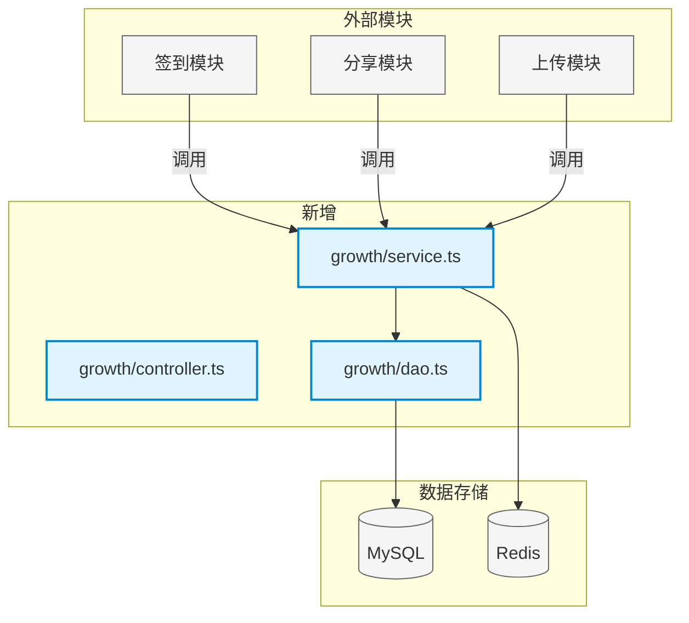
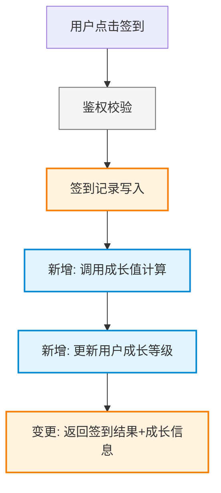

# 用户成长系统详细设计

## 一、项目背景

基于 PRD §3 用户成长体系需求，设计成长值计算与等级升级模块。见 PRD §3.2 成长值获取规则、§3.3 等级计算逻辑。

---

## 二、需求分析

| 需求点 | 优先级 | 现有能力 | 差距 | 涉及代码 |
|-------|-------|---------|------|---------|
| 签到获得成长值 | P0 | `[已有] src/modules/checkin/service.ts#createCheckin` | 需串联成长值计算 | `[变更] checkin/service.ts` |
| 成长值累加计算 | P0 | 不支持 | 需新增成长值记录与计算逻辑 | `[新增] growth/service.ts#calcGrowth` |
| 等级自动升级 | P0 | 不支持 | 需新增等级判定与升级逻辑 | `[新增] growth/service.ts#updateUserLevel` |
| 成长值查询接口 | P1 | 不支持 | 需新增查询接口 | `[新增] growth/controller.ts#getGrowthInfo` |

---

## 三、设计目标

| 类别 | 目标 | 度量标准 |
|------|------|---------|
| 架构 | 成长模块独立可复用 | 其他模块通过 service 调用，无直接依赖 |
| 功能 | 支持 5 种行为触发成长值 | 签到、分享、上传、评论、邀请 |
| 性能 | 成长值计算 < 100ms | P99 延迟 |
| 一致性 | 成长值与等级强一致 | 无并发升级冲突 |

---

## 四、名词解释

| 术语 | 定义 | 对应代码 |
|------|------|---------|
| 成长值 | 用户通过行为获得的积分，累计决定等级 | `[新增] t_growth_record.points` |
| 成长阶段 | 用户等级阶段，如 L1-L10 | `[新增] src/modules/growth/enums.ts#GrowthStageEnum` |
| 成长行为 | 触发成长值的用户行为类型 | `[新增] src/modules/growth/enums.ts#GrowthActionType` |

---

## 五、方案设计

### 5.1 架构设计



**架构变更说明表**：

| 变更点 | 变更前 | 变更后 | 原因 |
|-------|-------|-------|------|
| 签到模块 | 独立功能，无成长值关联 | 签到后调用 growthService.calcGrowth | PRD §3.2 签到需累计成长值 |
| 用户等级 | 无等级体系 | 新增 t_user.growth_level 字段 | PRD §3.3 需展示用户等级 |

### 5.2 模块职责划分

| 模块 | 职责 | 状态 | 变更说明 |
|------|------|------|---------|
| checkin | 签到记录与状态管理 | `[已有]` | - |
| growth/service | 成长值计算与等级升级 | `[新增]` | - |
| growth/controller | 成长值查询接口 | `[新增]` | - |
| growth/dao | 成长记录数据访问 | `[新增]` | - |

### 5.3 流程设计

#### 5.3.1 用户签到获得成长值

**流程图**：



**代码映射表**：

| 流程节点 | 对应代码 | 状态 |
|---------|---------|------|
| 鉴权校验 | `src/middleware/auth.ts#verifyToken` | `[已有]` |
| 签到记录写入 | `src/modules/checkin/service.ts#createCheckin` | `[已有]`→`[变更]` |
| 调用成长值计算 | `src/modules/growth/service.ts#calcGrowth` | `[新增]` |
| 更新用户成长等级 | `src/modules/growth/service.ts#updateUserLevel` | `[新增]` |
| 返回签到结果 | `src/modules/checkin/controller.ts#checkin` | `[变更]` |

**变更明细表**：

| 流程节点 | 对应代码 | 怎么改 | 为什么改 |
|---------|---------|-------|---------|
| 签到记录写入 | `src/modules/checkin/service.ts#createCheckin` | 写入签到记录后新增调用 `growthService.calcGrowth(userId, GrowthActionType.SIGN_IN)` | 串联签到与成长值计算 |
| 调用成长值计算 | `src/modules/growth/service.ts#calcGrowth` | 新建方法，入参 `(userId: number, action: GrowthActionType)`，查 t_growth_rule 获取对应成长值，插入 t_growth_record | PRD §3.2 签到行为需累计成长值 |
| 更新用户成长等级 | `src/modules/growth/service.ts#updateUserLevel` | 汇总 t_growth_record 计算总成长值，对照 t_growth_level_config 确定等级，更新 t_user.growth_level | PRD §3.3 成长值达到阈值时自动升级 |
| 返回签到结果 | `src/modules/checkin/controller.ts#checkin` | 返回值新增字段 `growthAdded: number, currentLevel: number` | 前端需展示本次签到获得的成长值 |

**影响范围**：

| 受影响代码 | 影响方式 | 需要的适配 |
|-----------|---------|-----------|
| `[已有] src/pages/checkin/index.tsx` | 消费签到接口 | 展示新增的 growthAdded 和 currentLevel |
| `[已有] tests/checkin.test.ts` | 签到单元测试 | 需 mock growthService 并断言新字段 |

---

## 六、数据库设计

**新增表**：

```sql
-- [新增] 表: t_growth_rule
CREATE TABLE `t_growth_rule` (
  `id` bigint NOT NULL AUTO_INCREMENT COMMENT '主键ID',
  `action_type` tinyint NOT NULL COMMENT '行为类型 [新增] GrowthActionType: 1-签到 2-分享 3-上传 4-评论 5-邀请',
  `points` int NOT NULL COMMENT '单次行为获得成长值',
  `daily_limit` int DEFAULT NULL COMMENT '每日上限次数，NULL 表示无限制',
  `status` tinyint DEFAULT 1 COMMENT '状态: 1-启用 0-禁用',
  `create_time` datetime NOT NULL DEFAULT CURRENT_TIMESTAMP COMMENT '创建时间',
  PRIMARY KEY (`id`),
  UNIQUE KEY `uk_action_type` (`action_type`)
) COMMENT='成长值规则配置表';

-- [新增] 表: t_growth_record
CREATE TABLE `t_growth_record` (
  `id` bigint NOT NULL AUTO_INCREMENT COMMENT '主键ID',
  `user_id` bigint NOT NULL COMMENT '用户ID [已有] t_user.id',
  `action_type` tinyint NOT NULL COMMENT '行为类型 [新增] GrowthActionType',
  `points` int NOT NULL COMMENT '获得成长值（正数）',
  `source_id` bigint DEFAULT NULL COMMENT '来源ID，如签到记录ID',
  `create_time` datetime NOT NULL DEFAULT CURRENT_TIMESTAMP COMMENT '创建时间',
  PRIMARY KEY (`id`),
  KEY `idx_user_id` (`user_id`),
  KEY `idx_create_time` (`create_time`)
) COMMENT='用户成长值记录表';

-- [新增] 表: t_growth_level_config
CREATE TABLE `t_growth_level_config` (
  `id` bigint NOT NULL AUTO_INCREMENT COMMENT '主键ID',
  `level` int NOT NULL COMMENT '等级',
  `stage` tinyint NOT NULL COMMENT '成长阶段 [新增] GrowthStageEnum: 1-新手 2-进阶 3-专家 4-大师',
  `min_points` int NOT NULL COMMENT '该等级所需最小成长值',
  `max_points` int NOT NULL COMMENT '该等级所需最大成长值',
  `level_name` varchar(50) NOT NULL COMMENT '等级名称，如"Lv.1 新手"',
  PRIMARY KEY (`id`),
  UNIQUE KEY `uk_level` (`level`)
) COMMENT='成长等级配置表';
```

**已有表变更**：

```sql
-- [变更] 表: t_user [已有]
ALTER TABLE `t_user`
  ADD COLUMN `growth_level` int DEFAULT 1 COMMENT '当前成长等级 [新增]',
  ADD COLUMN `growth_points` int DEFAULT 0 COMMENT '累计成长值 [新增]';
```

---

## 七、接口设计

### 7.1 获取用户成长信息 `[新增]`

**接口地址**：`GET /api/v1/growth/info`

**所在文件**：`[新增] src/modules/growth/controller.ts#getGrowthInfo`

**复用接口**：
- `[已有] src/middleware/auth.ts#verifyToken` - 鉴权
- `[已有] src/utils/response.ts#success` - 响应封装

**请求参数**：
| 参数 | 类型 | 必填 | 说明 | 来源 |
|------|------|------|------|------|
| user_id | number | Y | 用户ID | `[已有] t_user.id` |

**响应**：
```json
{
  "errno": 0,
  "data": {
    "currentLevel": 5,
    "currentPoints": 1250,
    "nextLevelPoints": 2000,
    "stage": 2,
    "stageName": "进阶"
  }
}
```

**核心逻辑伪代码**：
```
1. 校验 user_id 存在 → [已有] userService.getById()
2. 从 Redis 读取缓存的成长信息 → [新增] growthCache.get(userId)
3. 缓存未命中则查询数据库 → [新增] growthDao.getUserGrowth(userId)
4. 计算下一级所需成长值 → [新增] growthLevelConfigDao.getNextLevelThreshold()
5. 返回组装数据
```

### 7.2 获取成长值明细 `[新增]`

**接口地址**：`GET /api/v1/growth/records`

**所在文件**：`[新增] src/modules/growth/controller.ts#getGrowthRecords`

**复用接口**：
- `[已有] src/middleware/auth.ts#verifyToken` - 鉴权

**请求参数**：
| 参数 | 类型 | 必填 | 说明 | 来源 |
|------|------|------|------|------|
| user_id | number | Y | 用户ID | `[已有] t_user.id` |
| page | number | N | 页码，默认1 | - |
| page_size | number | N | 每页数量，默认20 | - |

**响应**：
```json
{
  "errno": 0,
  "data": {
    "total": 50,
    "list": [
      {
        "id": 1001,
        "actionType": 1,
        "actionName": "每日签到",
        "points": 10,
        "createTime": "2025-03-17 10:30:00"
      }
    ]
  }
}
```

**核心逻辑伪代码**：
```
1. 校验 user_id 存在 → [已有] userService.getById()
2. 分页查询成长记录 → [新增] growthDao.queryRecords(userId, page, pageSize)
3. 查询行为类型枚举映射 → [新增] GrowthActionType
4. 返回组装列表
```

---

## 八、风险与待办

| 风险 | 影响 | 缓解方案 |
|------|------|---------|
| 并发签到导致成长值重复计算 | 高 | 使用唯一索引 (user_id, source_id) 保证幂等 |
| 成长值累计性能瓶颈 | 中 | 使用 Redis 缓存累计值，异步刷库 |
| 等级升级并发冲突 | 中 | 使用乐观锁（version 字段）更新用户等级 |

**待确认项**：

1. 成长值是否支持扣减场景？（如违规扣减）负责人：产品 截止：2025-03-20
2. 历史用户成长值是否回溯计算？负责人：产品 截止：2025-03-20
3. 成长值明细保留多久？负责人：后端 截止：2025-03-22
