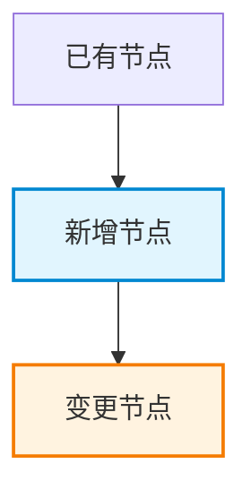

# 模块详细设计 - 写作规范指南

## 各节长度约束

| 章节 | 最大长度 | 格式要求 |
|------|---------|---------|
| 第一节（背景） | 3 句话 | 纯文字，仅引用 PRD 章节号 |
| 第二节（需求分析） | 1 张表 | 仅表格，表前表后不写文字 |
| 第三节（设计目标） | 1 张表，≤10 行 | 仅表格 |
| 第四节（名词解释） | 1 张表 | 仅表格，无新术语则跳过 |
| 第五节（方案设计） | 不限长度，必须详尽 | Mermaid 图 + 代码映射表 + 变更明细表 |
| 第六节（数据库设计） | 仅 SQL | SQL 含行内注释，不另写字段说明表 |
| 第七节（接口设计） | 按模板逐个接口 | 严格遵循模板，不写额外说明 |
| 第八节（其他） | 1 张表 + 编号列表 | 不展开描述 |

## 禁止项

- **禁止** 开场白："本节将讨论……"、"下面我们来分析……"
- **禁止** 总结句："综上所述……"、"如上表所示……"
- **禁止** 复述 PRD 内容 — 改写为 `见 PRD §3.2`
- **禁止** 解释为什么要展示表格/图表 — 直接展示
- **禁止** 废话短语："值得注意的是"、"如前所述"、"需要指出的是"
- **禁止** 描述接下来要做什么 — 直接做
- **禁止** SQL 行内注释已说明字段时再另写字段说明表

## 写作风格

- 能用表格绝不写段落
- 每个设计决策附一句话理由，不多写
- 所有代码引用使用完整路径：`src/modules/xxx/enums.ts#StatusEnum`
- 如果删掉一句话不丢失信息，就删掉它

## 代码可追溯规则

### 引用已有代码

| 元素类型 | 标注格式 | 示例 |
|---------|---------|------|
| 枚举值 | `[已有] 文件路径#枚举名` | `[已有] src/enums/user.ts#UserStatus` |
| 接口/API | `[已有] 文件路径#方法名` | `[已有] src/services/user.ts#getUserById` |
| 数据表 | `[已有] 表名` | `[已有] t_user` |
| 配置项 | `[已有] 文件路径#配置键` | `[已有] config/app.yaml#redis.ttl` |
| 类型定义 | `[已有] 文件路径#类型名` | `[已有] src/types/order.ts#OrderDTO` |

### 新增代码定位

```
[新增] 文件: src/modules/growth/enums.ts
[新增] 枚举: GrowthStageEnum { STAGE_1 = 1, STAGE_2 = 2 }
[新增] 说明: 用户成长阶段枚举，供 growth 模块内部使用
```

```
[变更] 文件: src/services/user.ts#getUserById
[变更] 内容: 返回值新增 growthLevel 字段
[变更] 影响: 所有调用方需适配新字段
```

## 验证清单

每个设计节点必须回答：

- [ ] 引用的枚举/常量是否在代码库中真实存在？
- [ ] 引用的接口签名是否与源码一致？
- [ ] 新增代码的目标文件路径是否存在？
- [ ] 复用的表结构字段是否与数据库一致？

## Mermaid 图例约定



| 节点类型 | classDef | 用途 |
|---------|---------|------|
| 新增节点 | `:::new_node` | 蓝色高亮 #e1f5fe |
| 变更节点 | `:::changed_node` | 橙色高亮 #fff3e0 |
| 已有节点 | 无 | 默认样式 |

## 接口设计模板

```markdown
### 7.X [接口名称] `[新增]`

**接口地址**：`POST /api/v1/xxx/xxx`

**所在文件**：`[新增] src/modules/xxx/controller.ts#methodName`

**复用接口**：
- `[已有] src/middleware/auth.ts#verifyToken` - 鉴权
- `[已有] src/utils/response.ts#success` - 响应封装

**请求参数**：
| 参数 | 类型 | 必填 | 说明 | 来源 |
|------|------|------|------|------|
| user_id | number | Y | 用户ID | `[已有] t_user.id` |
| stage | number | Y | 成长阶段 | `[新增] GrowthStageEnum` |

**响应**：
```json
{
  "errno": 0,
  "data": { "id": 1, "stage": 1 }
}
```

**核心逻辑伪代码**：
```
1. 校验 user_id 存在 → [已有] userService.getById()
2. 校验 stage 合法 → [新增] GrowthStageEnum
3. 写入 t_growth_record → [新增] growthDao.create()
4. 更新 t_user.growth_level → [变更] userDao.updateLevel()
```
```
