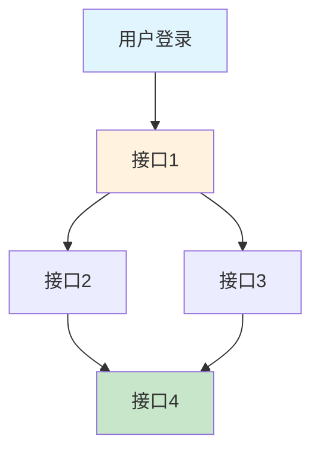
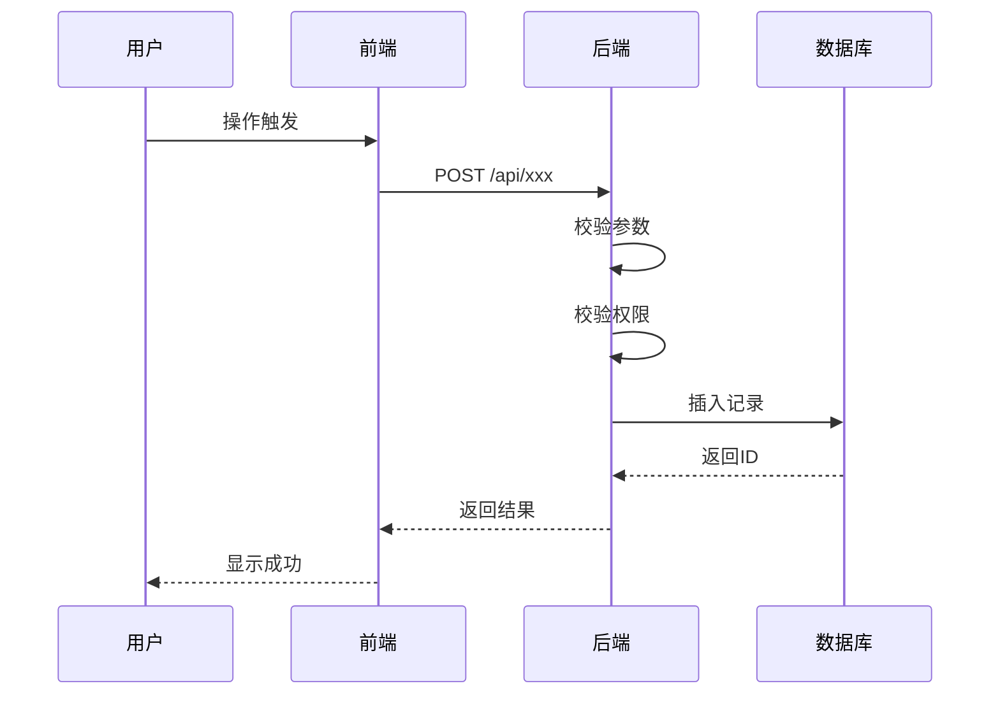

# 技术设计文档模板

> 本模板遵循接口协议标准格式规范，包含业务上下文、依赖关系和测试要点

---

# 一、概要

## 1、相关背景

[描述项目背景、业务目标、用户价值]

## 2、功能目标

[列出所有功能模块和详细功能点]

## 3、非功能目标

[描述性能、安全、可用性等要求]

## 4、方案要点

[简要说明技术方案的核心思路]

---

# 二、意义

[说明本次技术设计的业务价值和技术价值]

---

# 三、竞品对照

[如有竞品参考，在此说明]

---

# 四、设计思路与实现方案

## 1、主体设计思路与折衷

[描述整体架构设计思路和技术选型]

### 1.1 架构设计

[前后端分离架构、服务拆分策略、模块依赖关系]

### 1.2 数据设计

[核心实体和关系模型、数据库表结构、缓存策略]

### 1.3 技术选型

[技术栈选择和理由]

## 2、关键点设计

[详细说明关键技术点的设计方案]

### 2.1 [关键点1]

[设计方案]

### 2.2 [关键点2]

[设计方案]

## 3、对系统其他模块改动的需求和考量

[说明对现有系统的影响和改动]

## 4、API 接口定义

### 接口概览

| 接口名称 | 接口路径 | 方法 | 功能描述 | 优先级 | 依赖接口 |
|---------|---------|------|---------|--------|---------|
| [接口1] | /api/xxx | POST | [描述] | P0 | 无 |
| [接口2] | /api/yyy | GET | [描述] | P0 | 接口1 |

### 接口详细定义

#### 1. [接口名称]

**接口标识**: `API-{模块}-001`

**基本信息**:
- **接口名称**: [接口名称]
- **接口路径**: `/api/xxx`
- **请求方法**: `POST`
- **功能描述**: [详细描述接口功能]
- **优先级**: `P0`
- **负责人**: [开发负责人]
- **预计工时**: [X 人日]

**业务上下文**:
- **使用场景**: [描述接口在什么场景下被调用]
- **前置条件**: [调用接口前需要满足的条件]
  - 用户已登录
  - 拥有相应权限
- **后置影响**: [接口调用成功后的影响]
  - 数据库记录更新
  - 触发后续流程
- **业务规则**:
  - [业务约束1]
  - [业务约束2]

**依赖关系**:
- **前置接口**: [必须先调用的接口]
- **后置接口**: [可以在此接口后调用的接口]
- **关联接口**: [相关的其他接口]
- **数据依赖**: [依赖的数据表或数据源]

**请求参数**:

| 参数名 | 类型 | 必填 | 说明 | 限制 | 示例值 | 校验规则 |
|-------|------|------|------|------|--------|---------|
| param1 | string | 是 | [参数说明] | 1-50字符 | "示例" | 不能为空 |
| param2 | integer | 是 | [参数说明] | 枚举值 | 1 | 1=类型A, 2=类型B |
| param3 | string | 否 | [参数说明] | 0-200字符 | "描述" | 可为空 |

**请求示例**:
```json
{
  "param1": "示例值",
  "param2": 1,
  "param3": "描述信息"
}
```

**响应参数**:

**成功响应** (HTTP 200):

| 参数名 | 类型 | 说明 | 示例值 |
|-------|------|------|--------|
| code | integer | 响应码 | 200 |
| msg | string | 响应消息 | "OK" |
| data | object | 响应数据 | - |
| data.id | string | 资源ID | "xxx_123456" |
| data.name | string | 资源名称 | "示例名称" |
| data.createTime | string | 创建时间 | "2026-03-03 10:00:00" |

**成功响应示例**:
```json
{
  "code": 200,
  "msg": "OK",
  "data": {
    "id": "xxx_123456",
    "name": "示例名称",
    "createTime": "2026-03-03 10:00:00"
  }
}
```

**错误响应**:

| 错误码 | HTTP状态码 | 错误消息 | 触发条件 | 处理建议 |
|-------|-----------|---------|---------|---------|
| 40001 | 400 | "参数不能为空" | param1 为空 | 提示用户输入 |
| 40002 | 400 | "参数格式错误" | param1 格式不正确 | 提示正确格式 |
| 40301 | 403 | "无操作权限" | 用户无权限 | 提示申请权限 |
| 50001 | 500 | "系统错误" | 服务器异常 | 稍后重试 |

**错误响应示例**:
```json
{
  "code": 40001,
  "msg": "参数不能为空",
  "data": null
}
```

**性能要求**:
- **响应时间**: P95 < 500ms
- **并发量**: 支持 100 QPS
- **超时时间**: 5s

**安全要求**:
- **认证方式**: Bearer Token
- **权限校验**: 需要 `xxx:create` 权限
- **数据加密**: HTTPS 传输
- **敏感字段**: [列出敏感字段]

**测试要点**:
- **正常场景**:
  - 创建成功，返回资源ID
  - 创建后能在列表中查询到
- **边界值测试**:
  - 参数长度：最小值、最大值、超长
  - 枚举值：有效值、无效值
- **异常场景**:
  - 参数为空
  - 参数格式错误
  - 参数超长
  - 无权限
  - 重复创建
- **并发测试**:
  - 同时创建多个资源
  - 并发创建相同资源

**变更记录**:
- v1.0 (2026-03-03): 初始版本

---

#### 2. [接口名称2]

[按照相同格式定义其他接口]

---

### 接口依赖关系图



### 接口调用时序图



---

## 5、数据库设计

### 5.1 表结构设计

#### 表1: [表名]

| 字段名 | 类型 | 长度 | 必填 | 默认值 | 说明 | 索引 |
|-------|------|------|------|--------|------|------|
| id | varchar | 64 | 是 | - | 主键 | PRIMARY |
| name | varchar | 100 | 是 | - | 名称 | INDEX |
| status | tinyint | - | 是 | 1 | 状态 | - |
| create_time | datetime | - | 是 | CURRENT_TIMESTAMP | 创建时间 | - |
| update_time | datetime | - | 是 | CURRENT_TIMESTAMP | 更新时间 | - |

**索引设计**:
- PRIMARY KEY: `id`
- INDEX: `idx_name` (name)
- INDEX: `idx_status_create_time` (status, create_time)

**表关系**:
- 与 [表2] 一对多关系

### 5.2 数据迁移

[说明数据迁移方案]

---

## 6、错误处理和日志

### 6.1 错误处理策略

[说明错误处理机制]

### 6.2 日志规范

[说明日志记录规范]

---

## 7、监控和告警

### 7.1 监控指标

[列出需要监控的指标]

### 7.2 告警规则

[定义告警规则]

---

# 五、影响和风险总结

## 对用户的影响

[说明对用户的影响]

## 对性能的影响

[说明对性能的影响]

## 对私有化的影响

[说明对私有化部署的影响]

## 技术风险

[列出技术风险和应对措施]

---

# 六、规划排期

| 阶段 | 任务 | 负责人 | 预计工时 | 开始时间 | 结束时间 |
|------|------|--------|---------|---------|---------|
| 设计阶段 | 技术设计评审 | [姓名] | 0.5人日 | [日期] | [日期] |
| 开发阶段 | 后端开发 | [姓名] | 3人日 | [日期] | [日期] |
| 开发阶段 | 前端开发 | [姓名] | 2人日 | [日期] | [日期] |
| 测试阶段 | 功能测试 | [姓名] | 1人日 | [日期] | [日期] |
| 测试阶段 | 性能测试 | [姓名] | 0.5人日 | [日期] | [日期] |
| 上线阶段 | 灰度发布 | [姓名] | 0.5人日 | [日期] | [日期] |

**总计**: [X] 人日

---

# 七、待确认问题

[列出需要确认的问题]

---

# 八、评审意见

[记录评审意见]

---

# 九、参考资料

[列出所有参考的文档、链接、图片]

---

# 附录：接口协议 JSON Schema

```json
{
  "apiProtocol": {
    "version": "1.0",
    "baseUrl": "https://api.example.com",
    "authentication": {
      "type": "bearer",
      "tokenHeader": "Authorization",
      "tokenPrefix": "Bearer"
    },
    "apis": [
      {
        "apiId": "API-{模块}-001",
        "name": "[接口名称]",
        "path": "/api/xxx",
        "method": "POST",
        "description": "[功能描述]",
        "priority": "P0",
        "owner": "[负责人]",
        "estimatedHours": 2,
        "businessContext": {
          "scenario": "[使用场景]",
          "preconditions": ["前置条件1", "前置条件2"],
          "postconditions": ["后置影响1"],
          "businessRules": ["业务规则1", "业务规则2"]
        },
        "dependencies": {
          "prerequisiteApis": [],
          "subsequentApis": ["API-{模块}-002"],
          "relatedApis": [],
          "dataDependencies": ["表1", "表2"]
        },
        "request": {
          "contentType": "application/json",
          "parameters": [
            {
              "name": "param1",
              "type": "string",
              "required": true,
              "description": "[参数说明]",
              "constraints": {
                "minLength": 1,
                "maxLength": 50
              },
              "example": "示例值",
              "validationRules": ["不能为空"]
            }
          ],
          "example": {
            "param1": "示例值"
          }
        },
        "response": {
          "success": {
            "httpStatus": 200,
            "structure": {
              "code": {
                "type": "integer",
                "description": "响应码",
                "example": 200
              },
              "msg": {
                "type": "string",
                "description": "响应消息",
                "example": "OK"
              },
              "data": {
                "type": "object",
                "properties": {
                  "id": {
                    "type": "string",
                    "description": "资源ID",
                    "example": "xxx_123456"
                  }
                }
              }
            },
            "example": {
              "code": 200,
              "msg": "OK",
              "data": {
                "id": "xxx_123456"
              }
            }
          },
          "errors": [
            {
              "errorCode": 40001,
              "httpStatus": 400,
              "message": "参数不能为空",
              "trigger": "param1 为空",
              "suggestion": "提示用户输入"
            }
          ]
        },
        "performance": {
          "responseTime": "P95 < 500ms",
          "concurrency": "100 QPS",
          "timeout": "5s"
        },
        "security": {
          "authentication": "Bearer Token",
          "authorization": "xxx:create",
          "encryption": "HTTPS",
          "sensitiveFields": []
        },
        "testPoints": {
          "normalScenarios": [
            "创建成功，返回资源ID"
          ],
          "boundaryTests": [
            "参数长度：最小值、最大值、超长"
          ],
          "exceptionScenarios": [
            "参数为空",
            "参数格式错误"
          ],
          "concurrencyTests": [
            "同时创建多个资源"
          ]
        },
        "changelog": [
          {
            "version": "1.0",
            "date": "2026-03-03",
            "changes": "初始版本"
          }
        ]
      }
    ]
  }
}
```

---

**文档版本**: v2.0
**创建时间**: 2026-03-03
**最后更新**: 2026-03-03
**文档状态**: ✅ 符合接口协议标准格式规范
